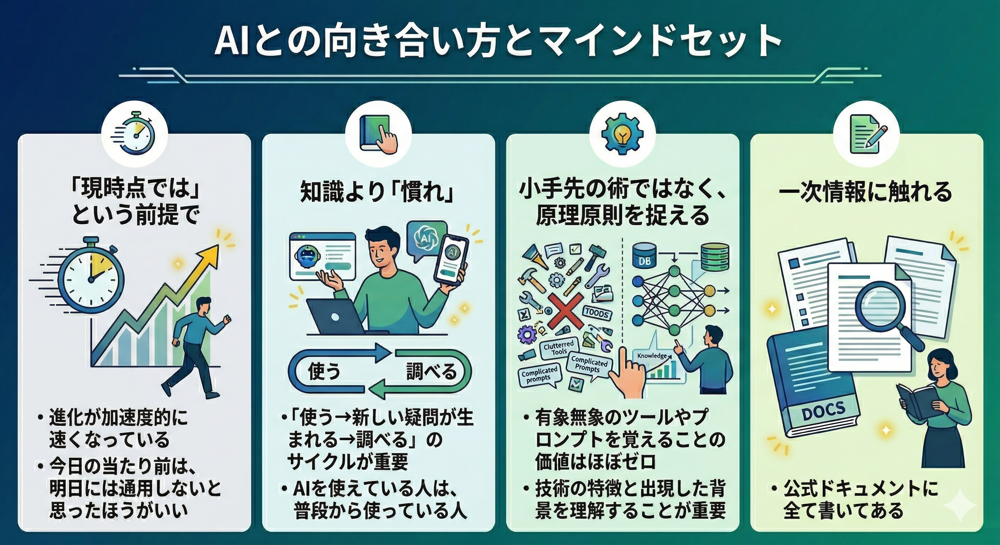

# AIとの向き合い方とマインドセット

---

## 「現時点では」という前提で

- 進化が**加速度的に**速くなっている
- 今日の当たり前は、明日には通用しないと思ったほうがいい

---

## 知識より「慣れ」

- AIを使えている人は、普段から使っている人
- 「**使う**→新しい疑問が生まれる→**調べる**」のサイクルが重要

---

## 小手先の術ではなく、原理原則を捉える

- 有象無象のツールやプロンプトを覚えることの価値はほぼゼロ
- 技術の特徴と出現した背景を理解することが重要

---

## 一次情報に触れる

- 公式ドキュメントに全て書いてある

---
