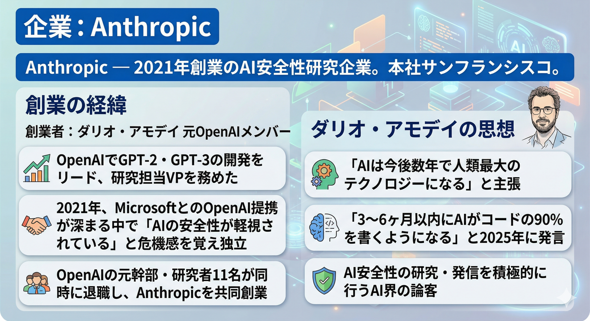
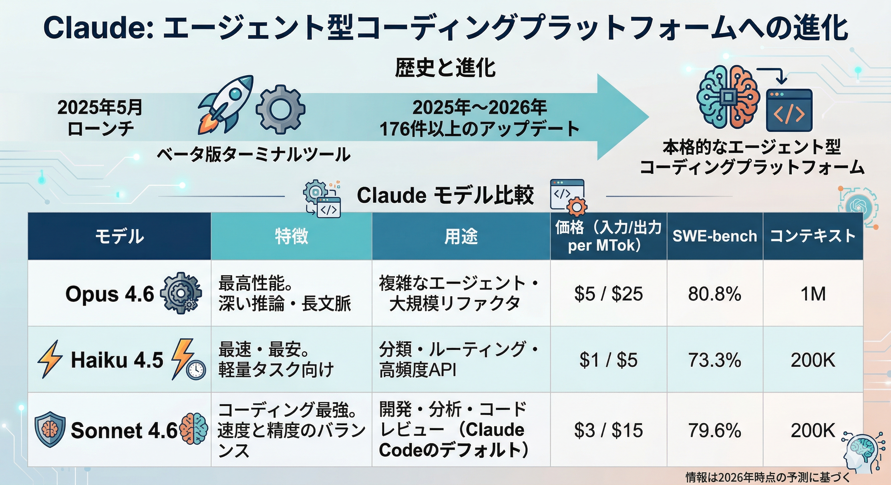

# Claude Code とは

---

## 企業: Anthropic

- **[Anthropic](https://www.anthropic.com/)** — 2021年創業のAI安全性研究企業。本社サンフランシスコ。

**創業の経緯**

- 創業者: **ダリオ・アモデイ** 元OpenAIメンバー
  - OpenAIでGPT-2・GPT-3の開発をリード、研究担当VPを務めた
  - 2021年、MicrosoftとのOpenAI提携が深まる中で「AIの安全性が軽視されている」と危機感を覚え独立
  - OpenAIの元幹部・研究者11名が同時に退職し、Anthropicを共同創業

**ダリオ・アモデイの思想**

- 「AIは今後数年で人類最大のテクノロジーになる」と主張
- 「3〜6ヶ月以内にAIがコードの90%を書くようになる」と2025年に発言
- AI安全性の研究・発信を積極的に行うAI界の論客

---

## モデル: Claude

2025年5月にローンチ。2025〜2026年で176件以上のアップデートを経て、ベータ版ターミナルツールから本格的なエージェント型コーディングプラットフォームへ進化した。

| モデル         | 特徴                                   | 用途                                                       | 価格（入力/出力 per MTok） | SWE-bench | コンテキスト |
| -------------- | -------------------------------------- | ---------------------------------------------------------- | -------------------------- | --------- | ------------ |
| **Opus 4.6**   | 最高性能。深い推論・長文脈             | 複雑なエージェント・大規模リファクタ                       | $5 / $25                   | 80.8%     | 1M           |
| **Haiku 4.5**  | 最速・最安。軽量タスク向け             | 分類・ルーティング・高頻度API                              | $1 / $5                    | 73.3%     | 200K         |
| **Sonnet 4.6** | コーディング最強。速度と精度のバランス | 開発・分析・コードレビュー（**Claude Code のデフォルト**） | $3 / $15                   | 79.6%     | 200K         |

---

## 形態: CLIツール

- ファイルの直接操作
- コマンドの自律実行
- 推論・実行ループ
  > 問題のトレース → 根本原因の特定 → 修正の実施

## 

## 他ツールとの違い

| 観点                 | Claude Code                  | Cursor                 | GitHub Copilot                   |
| -------------------- | ---------------------------- | ---------------------- | -------------------------------- |
| **インタラクション** | 自律エージェント             | 協調AIエディタ         | リアクティブなオートコンプリート |
| **コードベース認識** | コードベース全体             | コードベース全体       | 開いているファイルのみ           |
| **インターフェース** | ターミナルネイティブ         | VSCode派生IDE          | IDEの拡張機能                    |
| **得意領域**         | バックエンド・複雑な問題解決 | グリーンフィールド開発 | 既知作業の高速化                 |
| **料金**             | $20〜$200/月                 | $20/月                 | $10/月〜                         |
| **「最も好き」評価** | 46%（2026年初）              | 19%                    | 9%                               |

---

## 料金プラン（2026年）

| プラン         | 月額     | 主な内容                                                       |
| -------------- | -------- | -------------------------------------------------------------- |
| **Pro**        | $20      | 個人向け。Sonnet 4.6 + Opus 4.6。ターミナル・Web・デスクトップ |
| **Max 5x**     | $100     | Proの約5倍の利用量（5時間で約88,000トークン）                  |
| **Max 20x**    | $200     | Proの約20倍（5時間で約220,000トークン）                        |
| **Team**       | $20〜/席 | 最低5席。Claude Code は Premium席($100/席)のみ                 |
| **API**        | 従量制   | Sonnet 4.6：入力$3/MTok、出力$15/MTok                          |
| **Enterprise** | 要相談   | 500Kコンテキスト、HIPAA対応、コンプライアンスツール            |

---

## 参考文献

1. [Claude Code overview - 公式ドキュメント](https://code.claude.com/docs/en/overview)
2. [Claude Code vs Cursor vs GitHub Copilot: 30日間の比較](https://dev.to/dextralabs/claude-code-vs-cursor-vs-github-copilot-honest-comparison-after-30-days-1030)
3. [Claude Code Full Stack解説（MCP・Skills・Subagents・Hooks）](https://alexop.dev/posts/understanding-claude-code-full-stack/)
4. [Claude Code 料金プラン 2026](https://www.ssdnodes.com/blog/claude-code-pricing-in-2026-every-plan-explained-pro-max-api-teams/)
5. [Claude Code vs Cursor vs GitHub Copilot 2026比較](https://dev.to/alexcloudstar/claude-code-vs-cursor-vs-github-copilot-the-2026-ai-coding-tool-showdown-53n4)
