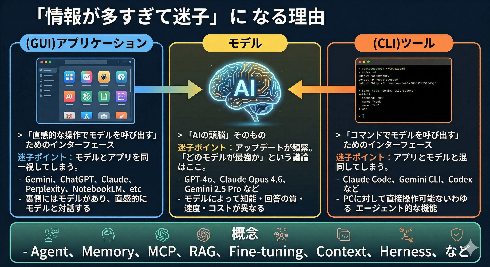

# 「情報が多すぎて迷子」になる理由

---

## モデル

> 「AIの頭脳」そのもの

**迷子ポイント**: アップデートが頻繁。 「どのモデルが最強か」という議論はここ。

- GPT-4o、Claude Opus 4.6、Gemini 2.5 Pro など
- モデルによって知能・回答の質・速度・コストが異なる

---

## （GUI）アプリケーション

> 「直感的な操作でモデルを呼び出す」ためのインターフェース

**迷子ポイント**: モデルとアプリを同一視してしまう。

- Gemini、ChatGPT、Claude、Perplexity、NotebookLM、etc
- 裏側にはモデルがあり、直感的にモデルと対話する

---

## （CLI）ツール

> 「コマンドでモデルを呼び出す」ためのインターフェース

**迷子ポイント**: アプリとモデルと混同してしまう。

- Claude Code、Gemini CLI、Codex など
- PCに対して直接操作可能ないわゆるエージェント的な機能

---

## 概念

- Agent、Memory、MCP、RAG、Fine-tuning、Context、Herness、など

---
