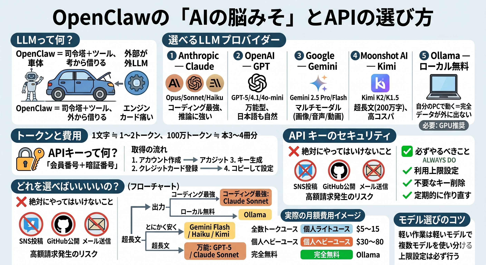

# LLMモデルとAPI（AIの「脳みそ」をどう選ぶ？）

## 

---

OpenClawは、それ自体には「AIの脳みそ」が入っていません。**外部のAIサービス（LLM）に脳みそ役を頼む**仕組みです。ここでは「どのAIを選べばいい？」「いくらかかる？」を解説します。

---

## LLMって何？

**LLM**（エル・エル・エム）は **Large Language Model = 大規模言語モデル** の略。ChatGPTやClaudeのような「文章を理解して返事を生成するAI」のことです。

OpenClawは、「司令塔（Gateway）」と「手足（ツール）」を持っていますが、**考える役のLLMは外から借りる**設計です。レンタカーに例えると:

- **OpenClaw** = 車体（運転席、ハンドル、タイヤ）
- **LLM** = エンジン（自分で選んで載せる）

---

## 選べるLLMプロバイダー

OpenClawは複数のAIサービスに対応しています。代表的な4社+オープンソース選択肢:

### 1. Anthropic（アンソロピック）— Claude

- **モデル例**: Claude Opus 4.6、Claude Sonnet 4.6、Claude Haiku 4.5
- **特徴**: コーディング・推論が非常に強い。長い文章も得意
- **価格イメージ**:
  - Haiku（軽量）: 入力 100万トークンあたり $1 程度
  - Sonnet（標準）: 入力 100万トークンあたり $3 程度
  - Opus（最強）: 入力 100万トークンあたり $15 程度
- **公式**: [console.anthropic.com](https://console.anthropic.com)

### 2. OpenAI（オープンAI）— GPT

- **モデル例**: GPT-5、GPT-4.1、GPT-4o-mini
- **特徴**: 万能型。日本語も自然
- **価格イメージ**: ミニ系は安価、フル系はClaude Sonnet並み
- **公式**: [platform.openai.com](https://platform.openai.com)

### 3. Google — Gemini（ジェミナイ）

- **モデル例**: Gemini 2.5 Pro、Gemini 2.5 Flash
- **特徴**: 画像・音声・動画も理解できる「マルチモーダル」が強い
- **価格イメージ**: Flash は最安クラス
- **公式**: [aistudio.google.com](https://aistudio.google.com)

### 4. Moonshot AI — Kimi（キミ）

- **モデル例**: Kimi K2、Kimi K1.5（Moonshot v1 系列）
- **特徴**: **超長文コンテキスト**（最大200万字クラス）が売り。中国発のモデルで、日本語・中国語・英語に対応。エージェント用途・ツール呼び出しにも強い
- **価格イメージ**: Claude/GPT より**大幅に安い**クラス。長文処理のコスパが特に良い
- **公式**: [platform.moonshot.ai](https://platform.moonshot.ai)

### 5. Ollama（オラマ）— ローカル無料

- **モデル例**: Llama 3、Mistral、Qwen など
- **特徴**: **自分のパソコンで動く＝完全無料・データが外に出ない**
- **必要なもの**: GPU推奨（なくても動くが遅い）
- **公式**: [ollama.com](https://ollama.com)

---

## トークンって何？「いくらかかるか」の単位

LLMの料金は **トークン** という単位で決まります。

### トークンの目安

- **英語**: 1単語 ≒ 1〜1.5トークン
- **日本語**: 1文字 ≒ 1〜2トークン
- **100万トークン** ≒ 日本語の本3〜4冊分

### 入力と出力で価格が違う

| 種類             | 意味                      | だいたいの単価   |
| ---------------- | ------------------------- | ---------------- |
| **入力トークン** | あなた→AIに送る文字       | 安い             |
| **出力トークン** | AI→あなたに返ってくる文字 | 入力の3〜5倍高い |

「長い質問を送るより、長い回答を受け取る方が高い」と覚えておきましょう。

---

## APIキーって何？

**APIキー**は、AIサービスを使うための「会員番号 + 暗証番号」がくっついた合言葉です。

### 取得の流れ

1. AIサービスのサイト（例: console.anthropic.com）でアカウント作成
2. クレジットカードを登録
3. 「Create API Key」ボタンを押す
4. 表示された長い文字列（例: `sk-ant-xxxxx...`）をコピー
5. OpenClawの設定画面に貼り付ける

### 絶対やってはいけないこと

- ❌ APIキーをSNSに投稿する
- ❌ GitHubに公開してしまう
- ❌ メールで誰かに送る

→ もし漏れたら**第三者が高額請求を発生させる**ことができてしまいます。

### 必ずやるべきこと

- ✅ 月額の利用上限を設定（プロバイダーのダッシュボードから）
- ✅ 不要になったキーは即削除
- ✅ 定期的にキーを作り直す（ローテーション）

---

## 「結局どれを選べばいいの？」フローチャート

```
プログラミングを頻繁にやる？
├── YES → Claude Sonnet（コーディング最強）
└── NO  ↓

データを絶対に外に出したくない？
├── YES → Ollama（ローカル無料）
└── NO  ↓

とにかく安く済ませたい？
├── YES → Gemini Flash / Claude Haiku / Kimi
└── NO  ↓

超長文（論文・議事録丸ごと）を処理したい？
├── YES → Kimi（200万字クラスの長文コンテキスト）
└── NO  ↓

何でも万能に使いたい？
└── → GPT-5 または Claude Sonnet
```

---

## 実際の月額費用イメージ

### 個人ライトユース（1日10回くらい）

**月 $5〜$15**（700円〜2,000円）

- デイリーブリーフィング
- メールチェック
- 簡単な質問

### 個人ヘビーユース（1日50回以上）

**月 $30〜$80**（4,000円〜1万円）

- メール自動処理
- スケジュール管理
- リサーチ自動化

### 完全無料（Ollama使用）

**月 $0**

- ただし: パソコンの電気代と、AIの賢さは多少落ちる

---

## モデル選びのコツ

### 1. 軽い作業には軽いモデルを

「天気を取得して送る」くらいなら Haiku/Flash で十分。**毎回 Opus を使うのはお金の無駄**です。

### 2. 複数モデルを使い分ける

OpenClawは設定で「タスクごとに別モデル」を割り当てることもできます。

- 普段の会話 → Haiku（安い）
- コードを書くとき → Sonnet（賢い）
- 重要な決断 → Opus（最強）

### 3. 上限設定は必ず行う

各プロバイダーのダッシュボードで「月 $20 まで」などの上限を絶対に設定しましょう。バグや暴走で青天井にならないための保険です。

---

## まとめ

| ポイント           | 覚えること                                             |
| ------------------ | ------------------------------------------------------ |
| OpenClawに脳はない | 外部LLMを「借りる」                                    |
| 5つの選択肢        | Anthropic / OpenAI / Google / Moonshot (Kimi) / Ollama |
| 料金はトークン制   | 出力は入力の3〜5倍高い                                 |
| APIキーは超大事    | 漏らさない・上限設定する                               |
| モデルは使い分け   | 軽い作業は軽いモデルで                                 |

---

関連: [重要な概念](14_重要な概念.md) | [セットアップ手順](03_セットアップ手順.md) | [セキュリティ注意事項](11_セキュリティ注意事項.md) | [競合ツール比較](12_競合ツール比較.md)
